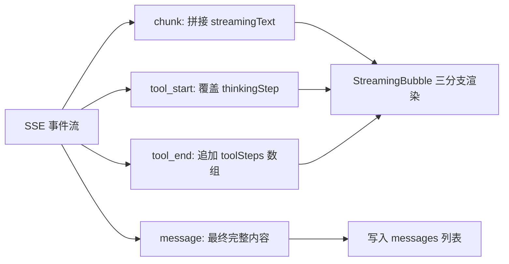
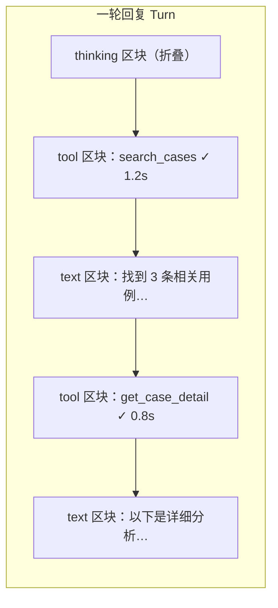

# AI 对话界面改造指导文档

> 目标：对标 ChatGPT / Claude / DeepSeek / Cursor / Rovo 等主流 AI 产品的对话体验，
> 重构 vue3-element-admin 内嵌 AI 聊天面板的消息渲染模型与流式交互。
>
> 涉及仓库：
> - 前端：`vue3-element-admin`
> - 后端：`youlai-fastapi-master`

---

## 一、现状分析

### 1.1 涉及文件

| 层 | 文件 | 职责 |
|---|---|---|
| 前端 | `src/layouts/components/LayoutChat.vue` | 聊天面板容器：浮窗/抽屉切换、历史会话、欢迎页、输入区、滚动控制 |
| 前端 | `src/layouts/components/chat/useChat.ts` | 核心 composable：SSE 流解析、消息列表状态、工具步骤收集、草稿/任务/澄清卡片逻辑 |
| 前端 | `src/layouts/components/chat/ChatMessage.vue` | 单条消息渲染：text / action_card / draft_card / task_card / clarify_card / confirm_card / error |
| 前端 | `src/layouts/components/chat/StreamingBubble.vue` | 流式占位气泡：等待态、工具执行态、纯文本流态 |
| 后端 | `app/ai/chat/orchestrator.py` | 聊天编排：事件产出（thinking / chunk / tool_start / tool_end / message / error） |
| 后端 | `app/ai/chat/usecases.py` | SSE 用例层：事件序列化与推送 |

### 1.2 当前流式渲染模型

当前模型是**"单一文本流 + 旁路状态"**：



- `streamingText`：一条不断增长的字符串，所有 chunk 混在一起；
- `thinkingStep`：只保留**当前**正在执行的工具名（后到的覆盖先到的）；
- `toolSteps`：已完成工具名数组（`string[]`），无参数、无耗时、无状态；
- 流结束后，工具列表被合并进 `metadata_json.tool_names`，正文则取 `message` 事件的完整内容或 `streamingText`。

### 1.3 与主流产品的差距

| 能力 | ChatGPT / Claude / DeepSeek / Cursor | 当前实现 |
|---|---|---|
| Turn 时间线 | 工具调用与文本**按发生顺序交错**展示，形成一条完整推理轨迹 | 工具徽标与文本流分离展示，顺序信息丢失 |
| 工具可视化 | 每个工具一行：名称 + 参数摘要 + 状态（运行中/成功/失败）+ 耗时，可展开看详情 | 只有工具名徽标，无参数、无耗时、无失败态 |
| 思考过程 | `thinking` 内容以独立折叠块流式展示（DeepSeek-R1 风格） | `thinking` 事件被直接丢弃（`useChat.ts` 中 case "thinking" 为空分支） |
| 历史回放 | 刷新后工具调用记录、思考过程完整保留 | 历史消息只有 `tool_names` 字符串数组，思考过程完全丢失 |
| 消息操作栏 | 复制 / 重新生成 / 点赞点踩，悬停显示 | `.msg-actions` 样式已定义但模板中**未渲染**（死代码） |
| 失败可见性 | 工具失败明确标红，可查看错误 | `tool_end` 无 status 字段，失败不可见 |

### 1.4 关键代码证据

- `useChat.ts` `case "thinking"`：空分支，注释写明"仅表示模型正在思考"，内容直接丢弃；
- `useChat.ts` `case "tool_start"`：`thinkingStep.value = data.name`，只留名字；
- `useChat.ts` `case "tool_end"`：`toolSteps.value.push(data.name)`，无耗时/状态；
- `ChatMessage.vue` 样式表末尾：`.msg-actions` 及 `.chat-message:hover .msg-actions` 已定义，但 `<template>` 中无任何 `msg-actions` 元素；
- `StreamingBubble.vue`：三个互斥分支（waiting / tool-state / text-state），工具态与文本态无法真正交错。

---

## 二、改造方案

### 2.1 核心思路：Segment 区块模型

把"一条助手回复"从**一个字符串**改为**一个有序区块数组（Segments）**，流式过程中增量构建，结束后整体落盘。这与 ChatGPT/Claude 前端的内部模型一致。

```typescript
/** 一轮助手回复 = 有序区块数组 */
type Segment =
  | {
      type: "tool"
      name: string                       // 工具名
      status: "running" | "done" | "failed"
      argsSummary?: string               // 参数摘要（阶段二后端提供）
      startedAt: number                  // performance.now() 时间戳
      durationMs?: number                // 耗时（tool_end 时结算）
      error?: string                     // 失败原因
    }
  | { type: "text"; content: string }    // 一段 Markdown 文本
  | { type: "thinking"; content: string } // 思考内容（可折叠）
```

规则：

1. `chunk` → 追加到**末尾的 text 区块**（若末尾不是 text 则新建一个）；
2. `tool_start` → 新建 `status: "running"` 的 tool 区块，记录 `startedAt`；
3. `tool_end` → 找到对应 running 区块，结算 `status` 和 `durationMs`；
4. `thinking` → 追加到末尾的 thinking 区块（流式展示思考内容）；
5. 工具与文本天然按发生顺序交错，无需额外排序。



### 2.2 阶段一：纯前端重构（不改后端协议）

后端现有事件已足够支撑 Segment 模型，阶段一**只动前端**：

| 改动点 | 文件 | 说明 |
|---|---|---|
| 新增 Segment 类型与构建逻辑 | `useChat.ts` | 用 `segments = ref<Segment[]>` 替代 `streamingText` / `thinkingStep` / `toolSteps` 三件套；`stopGeneration` 同步清理 |
| 新增 `TurnRenderer.vue` | `src/layouts/components/chat/TurnRenderer.vue` | 统一渲染 Segment 数组，流式中与历史消息共用同一组件 |
| 改造 `StreamingBubble.vue` | 同上 | 改为薄壳：直接把 `segments` 传给 `TurnRenderer` |
| 改造 `ChatMessage.vue` | 同上 | 历史消息若 `metadata_json.segments` 存在则走 `TurnRenderer`，否则回退现有渲染（兼容旧数据） |
| 落盘 segments | `useChat.ts` | 流结束后把 segments 序列化进 `metadata_json.segments`，历史回放零损耗 |
| 渲染消息操作栏 | `ChatMessage.vue` | 把已有的 `.msg-actions` 样式用起来：复制 / 重试，悬停显示 |

**兼容性保证**：`metadata_json` 是自由 JSON，旧消息没有 `segments` 字段时走现有渲染分支，无需数据迁移。

### 2.3 阶段二：后端 SSE 协议增强

阶段一上线后再增强协议，让 Segment 信息更丰富：

| 事件 | 现状 | 增强后 |
|---|---|---|
| `tool_start` | `{ name }` | 增加 `args_summary`（参数摘要，如 `"模块ID=12, 关键字=登录"`）、`call_id`（配对 start/end） |
| `tool_end` | `{ name }` | 增加 `status`（success/failed）、`duration_ms`、`error` |
| `thinking` | 心跳空事件 | 可选：携带思考文本，支持 DeepSeek-R1 风格思考流 |
| `message` | `{ content, msg_type, ... }` | 可选：直接下发完整 `segments`，前端免拼装 |
| `done` | 无 | 新增：携带 `usage`（token 用量）、`turn_id`，用于操作栏展示与问题定位 |
| `error` | `{ message }` | 增加 `turn_id`，错误与轮次关联 |

涉及后端文件：`app/ai/chat/orchestrator.py`（事件产出）、`app/ai/chat/usecases.py`（事件序列化）。后端 Agent 侧 `runner.py` 已通过 `astream_events` 拿到工具耗时与 token 用量，下发成本低。

### 2.4 分段渲染注意点

- **Markdown 跨区块**：每个 text 区块独立渲染，避免工具区块把一段未闭合的 ``` 代码块切断——区块边界即 chunk 流中工具事件的插入点，天然不会切断代码块内部；
- **thinking 区块默认折叠**，标题显示"思考过程（耗时 Xs）"，展开后可滚动查看；
- **tool 区块行内展示**：`✓ 搜索用例 · 1.2s`，点击展开参数摘要与错误详情；`running` 态显示 Loading 图标与已耗时 ticking；
- **自动滚动**：现有 `watch([messages.length, streamingText])` 需改为 watch `segments` 的长度与末区块内容。

---

## 三、实施优先级

| 优先级 | 内容 | 阶段 | 理由 |
|---|---|---|---|
| P0 | Segment 模型 + `TurnRenderer`，流式与历史共用渲染 | 一 | 一切体验改进的地基；不改协议，风险最低 |
| P1 | 工具行状态/耗时/失败态（前端先用 `tool_end` 到达时间结算耗时） | 一 | 用户感知最强：知道 AI 在干什么、卡在哪 |
| P2 | 消息操作栏（复制/重试）+ 思考过程折叠块 | 一 | 样式已是现成的，补齐模板即可 |
| P3 | SSE 协议增强（args_summary / status / usage / done 事件） | 二 | 需要前后端联调，放在模型稳定之后 |

---

## 四、待确认事项

1. **thinking 内容是否下发**：后端目前 `thinking` 只是心跳。若要 DeepSeek 风格思考流，需确认模型侧是否产出思考文本（取决于所用 LLM 是否支持 reasoning 输出）。
2. **segments 是否入库**：阶段一方案是前端拼装后存入 `metadata_json`（随消息保存）；若希望后端权威生成，则并入阶段二 `message` 事件下发。
3. **工具参数摘要的脱敏**：`args_summary` 可能包含用例内容，需确认是否截断/过滤。
4. **旧消息处理**：不迁移历史数据，旧消息维持现有渲染（只有 `tool_names` 列表），是否接受新旧并存。

---

## 五、验收标准

- 流式过程中，工具调用与文本按真实发生顺序交错展示；
- 每个工具行可见：名称、状态（运行中/成功/失败）、耗时；
- 流结束刷新页面后，工具调用记录与展示形态完全一致；
- 助手消息悬停出现操作栏，复制功能可用；
- 旧会话（无 `segments` 字段）打开无报错、展示不退化。
